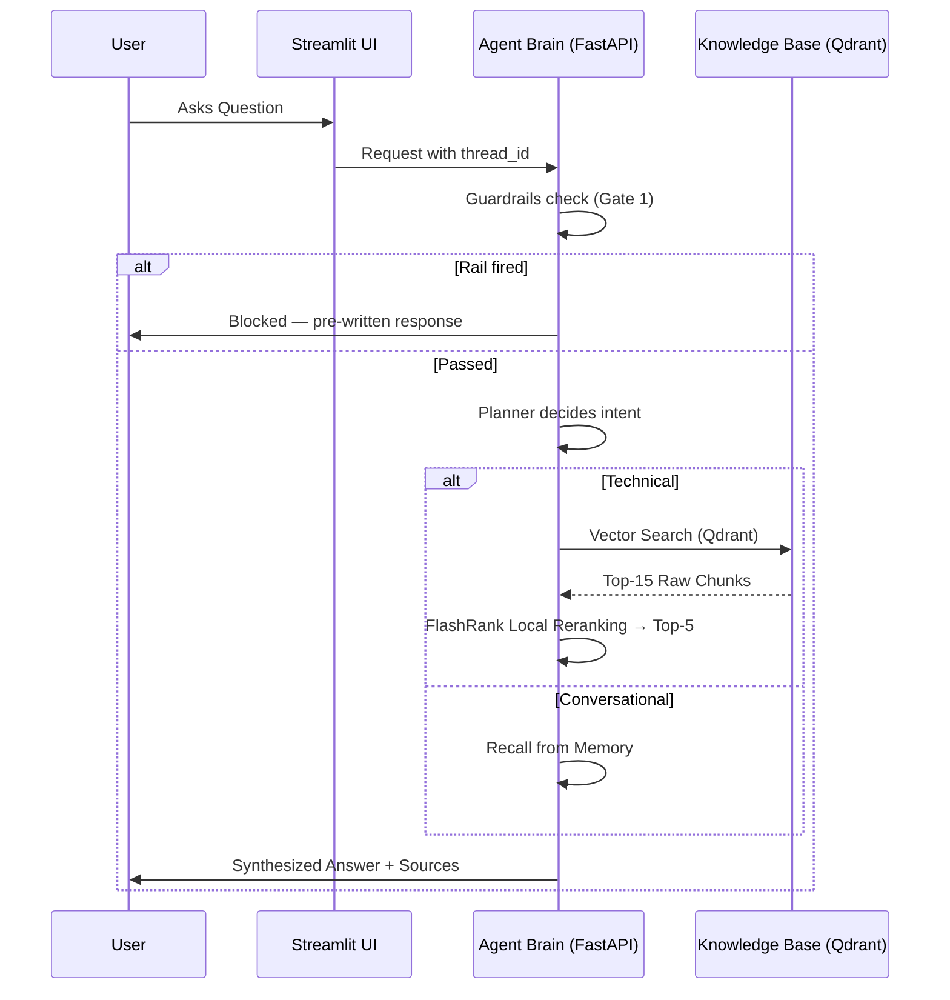

# 🤖 Enterprise Agentic RAG

A production-grade, agentic RAG system built with **LangGraph**, hardened with **NeMo Guardrails**, routed through a **Portkey LLM gateway**, fully traced with **Logfire + LangSmith**, and validated by a **6-metric RAGAS evaluation suite** run against an adversarial (noise-injected) knowledge base.

This is the upgraded successor to my earlier [Financial RAG API]('https://github.com/Spectraa28/Financial-Rag.git') — same core problem (answer questions over enterprise documents), rebuilt as a full agentic pipeline with the safety, resilience, and evaluation layers a production deployment actually needs.

---

## 🌟 Why This Exists

Most RAG systems treat every query the same — vector search, stuff context, generate. That breaks down in production:

- Greetings and follow-up questions ("what did I just ask?") shouldn't trigger a vector search.
- Off-topic or adversarial prompts shouldn't reach an expensive 70B model.
- A single LLM provider is a single point of failure.
- "It works on the questions I tried" is not the same as "it works."

This system is built around a **Planner → Retriever → Responder** agentic loop that decides *whether* retrieval is even necessary, sits behind a guardrail gate that filters bad input before it costs a token, routes every LLM call through a gateway that can fail over and cache, and is scored end-to-end with a real evaluation harness — not vibes.

---

## 🏗️ High-Level Flow



---

## ✨ Key Features

| Layer | What it does |
|---|---|
| **Agentic routing** | A LangGraph `Planner` node decides per-turn whether a query needs retrieval or can be answered from conversation memory alone — no wasted search on "hi" or "what's my name." |
| **Conversational memory** | `MemorySaver` checkpointing keyed by `thread_id` — multi-turn context survives across requests. |
| **Input guardrails** | NeMo Guardrails (Colang) blocks off-topic questions and jailbreak attempts *before* they reach the LLM or vector DB. |
| **LLM gateway** | Every LLM call routes through Portkey — automatic fallback to a secondary model, retry on transient errors, and response caching, with zero business-logic changes. |
| **Two-stage retrieval** | Fast bi-encoder search (Qdrant, cosine similarity) narrows to 15 candidates; a local ONNX cross-encoder (FlashRank) reranks down to the top 5 most relevant chunks. |
| **Noise-robustness testing** | Real docs and dozens of unrelated distractor documents live in the *same* vector collection with no metadata filtering — proving retrieval + reranking find signal in noise semantically, not by cheating. |
| **Dual observability** | Pydantic Logfire traces infrastructure (API latency, parsing, DB queries); LangSmith traces the agent's reasoning (state transitions, prompts, token usage). |
| **Full eval suite** | 15 golden Q&A pairs + 6 guardrail test cases, scored across 6 RAGAS metrics plus a zero-LLM tool-correctness check. |

---

## 🧰 Tech Stack

| Category | Tools |
|---|---|
| Orchestration | LangGraph (`StateGraph`, `MemorySaver`) |
| LLMs | Groq (`llama-3.3-70b-versatile` generation, `llama-3.1-8b-instant` guardrail gate) |
| LLM Gateway | Portkey (fallback, retry, caching, observability) |
| Guardrails | NeMo Guardrails (Colang DSL) |
| Embeddings | Google `gemini-embedding-2-preview` (3072-dim), with a local `all-mpnet-base-v2` (Sentence-Transformers) fallback if Gemini is unreachable |
| Vector DB | Qdrant Cloud (cosine similarity) |
| Reranking | FlashRank — local ONNX cross-encoder (`ms-marco-MiniLM-L-6-v2`) |
| API | FastAPI |
| UI | Streamlit |
| Observability | Pydantic Logfire, LangSmith |
| Evaluation | RAGAS 0.4.3 (Faithfulness, Answer Relevancy, Context Precision/Recall, Answer Correctness) + custom Jaccard Tool Correctness |
| Document Parsing | pypdf / pdfplumber (PDF), BeautifulSoup (HTML), python-docx / python-pptx (Office), plain text |

---

## 📂 Project Structure

```
app/
  main.py                    FastAPI entrypoint — Gate 1 (guardrails) → Gate 2 (LangGraph)
  config.py                  Centralised settings loaded from environment
  agents/
    graph.py                 LangGraph StateGraph wiring + MemorySaver
    state.py                 AgentState schema
    nodes/
      planner.py             Decides CONVERSATIONAL vs. technical search query
      retriever.py           Qdrant search → FlashRank rerank
      responder.py           Final synthesis via Portkey
  guardrails/
    colang_rules.py          Colang flows: off-topic, jailbreak, dialog control
    rails.py                 LLMRails singleton + guard() gate function
  gateway/
    client.py                Portkey client, ChatOpenAI factory, cache-status extraction
  ingestion/
    processor.py             Parse → chunk → embed → index pipeline
    chunking/splitter.py     Paragraph-aware semantic chunker
    loaders/                 pdf.py, html.py, text.py, office.py
  services/retrieval/
    embedding.py             Gemini embedding client with ST fallback
    qdrant_service.py        Vector search
    ranking_service.py       FlashRank reranking with graceful fallback
ui/
  app.py                     Streamlit chat interface
evals/
  golden_dataset.json        15 Q&A pairs + 6 guardrail tests
  pipeline.py                Phase 1 — live pipeline runner
  metrics.py                 Phase 2 — RAGAS scoring (rate-limit aware)
  guardrails_eval.py         TP/TN/FP/FN scoring for the guardrail layer
  app.py                     Streamlit eval dashboard
DATA/
  true_data/                 Real source docs (Kubernetes Jobs, CronJobs, autoscaling, etc.)
  noisy_data/                Distractor documents used to stress-test retrieval
```

---

## 🧠 How the Agent Thinks

### 1. Guardrails — Gate 1
NeMo Guardrails runs before anything else. It uses a cheap model (`llama-3.1-8b-instant`) purely for intent classification against Colang-defined flows:

- **Off-topic guard** — blocks jokes, recipes, weather, anything outside enterprise IT
- **Jailbreak shield** — blocks "ignore all instructions," "you are now DAN," etc.
- **Dialog control** — handles greetings, farewells, and capability questions consistently

Since `rails.generate()` returns a plain string with no `fired` flag, the gate detects a block by checking whether the response contains one of a set of distinctive phrases lifted verbatim from the Colang `define bot` blocks — phrases specific enough that no genuine technical answer would ever contain them. If a rail fires, the request returns immediately; Qdrant, FlashRank, and the 70B model are never touched.

### 2. Planner
Given the full conversation history and the latest message, the planner (via the Portkey-backed LLM) outputs either `CONVERSATIONAL` or a refined search query. Greetings and questions answerable from memory skip retrieval entirely.

### 3. Retriever — Two-Stage Pipeline
- **Stage 1 (Qdrant, bi-encoder):** the query is embedded and compared via cosine similarity against the vector store — fast, but semantically fuzzy — returning the top 15 candidates.
- **Stage 2 (FlashRank, cross-encoder):** those 15 are re-scored locally by an ONNX-quantized cross-encoder that evaluates the query and each document *together*, capturing nuance the bi-encoder misses. Only the top 5 go to the LLM. If FlashRank fails to load, the system falls back to raw Qdrant ordering rather than erroring out.

### 4. Responder
Synthesizes the final answer from the reranked context and conversation history via the Portkey gateway, and reads the `x-portkey-cache-status` header to report cache hits back to the UI.

---

## 🔀 LLM Gateway (Portkey)

Every LLM call — planner and responder alike — goes through Portkey instead of hitting Groq directly:

- **Fallback:** primary model (`llama-3.3-70b-versatile`) automatically fails over to a secondary (`llama-3.1-8b-instant`) on a non-2xx response
- **Retry:** transient errors (429/503) get retried before the fallback triggers
- **Caching:** identical requests are served from cache — instant, zero tokens
- **Observability:** every request is automatically logged (prompt, response, tokens, cost, latency, cache status) with no extra code, because it's all routed through the gateway

The routing config lives in the Portkey dashboard, referenced by a saved config slug — changing fallback order or retry counts doesn't require a redeploy.

**Guardrails vs. Gateway** — these operate at different layers: guardrails ask *"should this request happen at all?"*, the gateway asks *"how should this request be sent?"* Both run on every query, in that order.

---

## 🕵️ Observability

| Tool | Tracks |
|---|---|
| **Pydantic Logfire** | API latency, which parser handled which file, Qdrant query timing, ingestion spans |
| **LangSmith** | Graph state transitions between nodes, exact prompts sent to Groq, token usage, chain-of-thought |

Traces from both are linked by a common ID, so a bug spotted in the UI can be traced through the exact LLM call in LangSmith and the corresponding infra span in Logfire.

---

## 🧪 Evaluation Suite

Building a RAG system isn't the same as knowing it works. This project ships a full evaluation harness rather than relying on manual spot-checks.

### Golden Dataset
15 real Q&A pairs generated from the actual `DATA/true_data/` source documents (Kubernetes Jobs, CronJobs, HPA/VPA autoscaling, job monitoring, parallel work queues), plus 6 guardrail test cases (jailbreak / off-topic / legitimate-IT) labeled with expected block/pass outcomes.

### Two-Phase Pipeline

**Phase 1 — Live Pipeline:** each golden question is sent to the running `/query` endpoint; the actual response, retrieved contexts, and detected tool call are captured.

**Phase 2 — RAGAS Scoring:** 6 experiments run against the enriched dataset, using a *separate* Groq key (`JUDGE_GROQ`) so eval runs can never rate-limit the live app:

| # | Metric | Category | What it catches |
|---|---|---|---|
| 1 | Faithfulness | Generation | Hallucinated facts not present in retrieved context |
| 2 | Answer Relevancy | Generation | On-topic but non-responsive answers |
| 3 | Context Precision | Retrieval | Irrelevant chunks ranked above relevant ones |
| 4 | Context Recall | Retrieval | Retriever missing content the reference answer needs |
| 5 | Answer Correctness | Generation | Factual mismatch against ground truth |
| 6 | Tool Correctness | Agent/Planner | Wrong tool routing (Jaccard overlap, zero LLM calls) |

Scores are bucketed: **≥0.75 ship it**, **0.50–0.75 investigate**, **<0.50 fix before shipping**.

The eval pipeline is rate-limit engineered, not just rate-limit aware — contexts are truncated to 300 characters (2 chunks max), samples are scored one at a time (`abatch_score` fires concurrent calls per sample, so batching further would blow the TPM ceiling), and cooldowns are calibrated against Groq's free-tier 6,000 TPM `on_demand` limit, with `asyncio.sleep` (not `time.sleep`) so the Streamlit dashboard can keep showing live progress during the ~50-minute run.

### Guardrails Scoring
Each of the 6 adversarial/legitimate test inputs is classified as TP / TN / FP / FN based on whether `thought_process` shows `"Intent: Guardrails Fired"` — giving precision, recall, and accuracy for the safety layer specifically.

---

## 🚀 Getting Started

### Environment Variables

| Variable | Purpose |
|---|---|
| `GROQ_API_KEY` | Primary Groq key — planner + responder |
| `GROQ_FALLBACK_API_KEY` | Portkey fallback target |
| `PORTKEY_API_KEY` | LLM gateway routing, caching, retries |
| `GEMINI_API_KEY` | Embedding generation (3072-dim) |
| `QDRANT_API_KEY` / `QDRANT_CLUSTER_ENDPOINT` | Vector database |
| `LOGFIRE_TOKEN` | Infra tracing |
| `LANGSMITH_API_KEY` / `LANGSMITH_PROJECT` / `LANGSMITH_TRACING` | Agent tracing |
| `JUDGE_GROQ` | Separate key for the eval harness's LLM judge |
| `BACKEND_URL` | URL the Streamlit UI uses to reach FastAPI |

Copy `.env.example` → `.env` and fill in your values. **Never commit `.env` — it's gitignored.**

### Run the Ingestion Pipeline

```bash
python -m app.ingestion.processor DATA --wipe
```

Scans `DATA/`, maps subfolders to source types (`true` / `noisy`), parses each file with the appropriate loader, chunks it, embeds it, and upserts it into Qdrant.

### Run the API + UI

```bash
# Terminal 1 — backend
uvicorn app.main:app --reload --port 8000

# Terminal 2 — Streamlit chat UI
streamlit run ui/app.py
```

### Run the Eval Suite

```bash
streamlit run evals/app.py
```

Open `http://localhost:8501` and step through **Ground Truth → Live Pipeline → Eval Metrics**.

---

## ⚠️ Notable Design Decisions

- **Logfire must be configured before any other import.** Calling `logfire.info()`/`logfire.span()` before `logfire.configure()` silently poisons the process for the rest of its lifetime — so `main.py` configures Logfire from raw `os.getenv()` calls at the very top of the file, before even importing `app.config`.
- **Everything heavy loads lazily.** The Gemini embedding client and the FlashRank ONNX model are only initialized on first use, not at import time — keeps FastAPI startup near-instant and avoids the same Logfire-poisoning risk from eager SDK initialization.
- **Reranking is custom, not LangChain's built-in wrapper.** A hand-rolled `ranking_service.py` gives granular Logfire spans around the cross-encoder call and a guaranteed graceful fallback to raw Qdrant ordering on failure — LangChain's `FlashrankRerank` compressor would throw a 500 on failure instead.

---

## 📈 What's Different From the Previous (Financial RAG) Version

| | Before | Now |
|---|---|---|
| Query handling | Fixed pipeline, every query searched | Agentic planner decides if search is needed |
| Memory | Stateless per request | Thread-based conversational memory |
| Bad input | Reached the LLM directly | Blocked at a guardrail gate first |
| LLM calls | Direct provider calls | Routed through a gateway with fallback + caching |
| Confidence in quality | "Seems to work" | 6-metric RAGAS suite + guardrail TP/TN/FP/FN scoring |